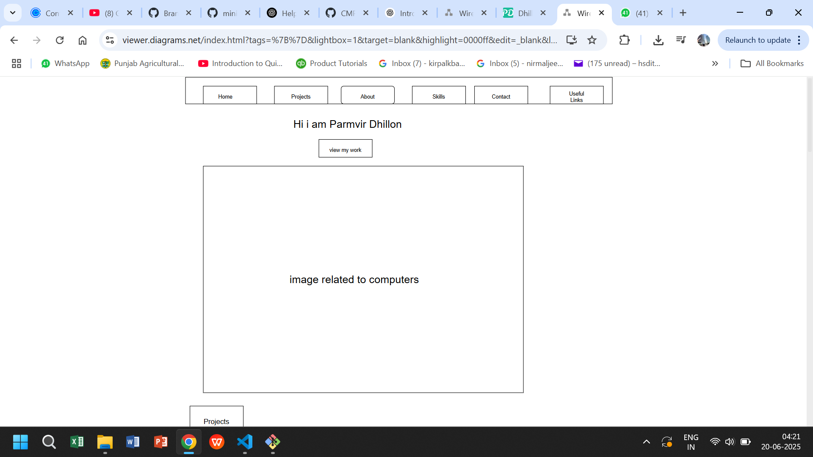
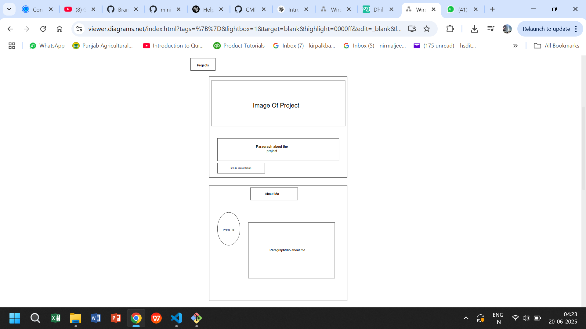
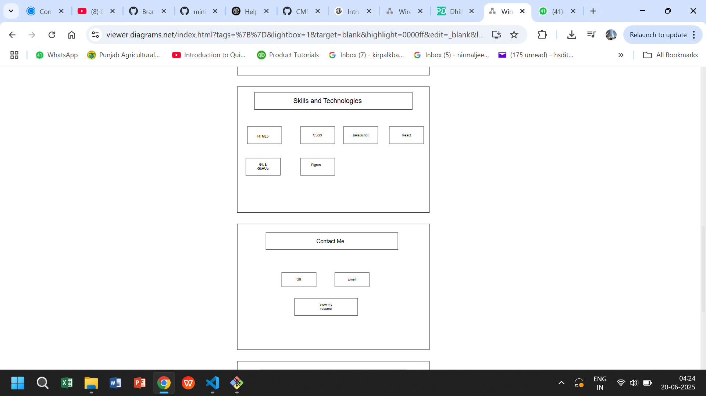
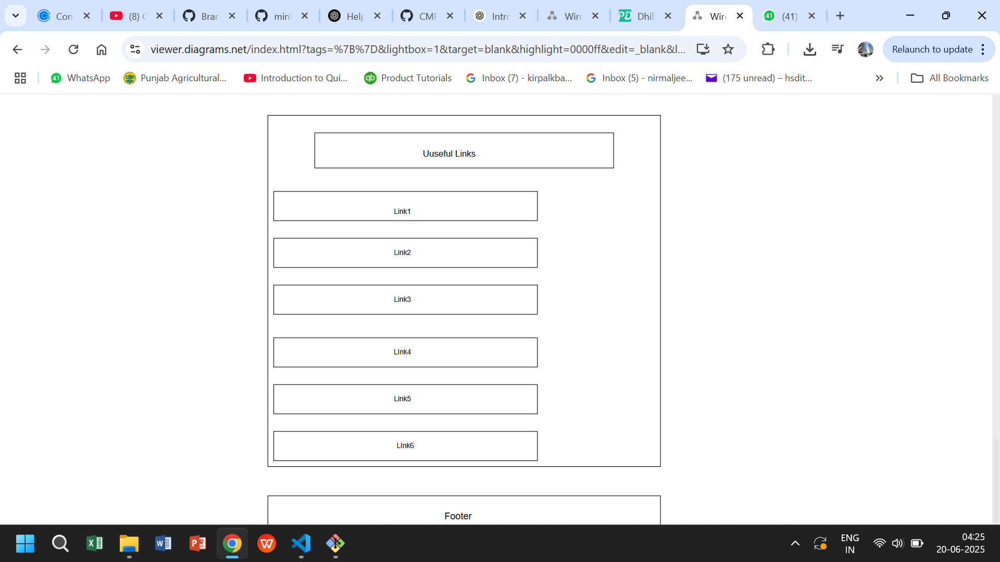

// PROFESSOR TOLD TO WRITE IN THE READ ME FILE THAT MY COMMIT HISTORY/ISSUES ETC ARE LOCATED IN MY MINI-PROJECT REPO

# Mini-Project (45 marks)

[View Instructions Here](Mini-project.md)

[How to use Github / How to submit](https://parsa-rajabi.github.io/CMPT-276/#/labs?id=github-classroom).

For this lab, you will include all of your "answers" in this README file. Make sure to cite any sources you use. 

## Task 0: Declare your AI Usage

After   you completed this lab, make sure to submit the AI declaration form via MS Form and also upload a PDF copy of your responses to this repository and include the link to PDF in this README file. Note, you must submit this form regardless if you use AI or not. Failure to submit this form will be considered a violation of AI course policy. More details about the AI-usage course policy can be found [here](https://parsa-rajabi.github.io/CMPT-276/#/ai-policy).

[Link to AI Usage Disclosure MS Form](https://parsa-rajabi.github.io/CMPT-276/#/ai-policy?id=disclosure-of-ai-use)

- You will need to log in with your SFU email to access the form.

Name the file in the following format: .

`Mini_Project_AI_Declaration_FirstName_LastName_StudentID.pdf`

Example (Mini Project): .

`Mini_Project_AI_Declaration_Parsa_Rajabi_123456789.pdf`

More detailed submission instructions can be found via the [lab page](https://parsa-rajabi.github.io/CMPT-276/#/labs).

### 📄 AI Declaration

[Click here to view the AI Declaration Form (PDF)](Mini_Project_AI_Declaration_PArmvir_dhillon_301449799.pdf)

## Task 1: Website Wireframe

Include screenshots of your website wireframe here. Make sure the wireframe is clear and easy to understand/read. To compliment your wireframes, describe the layout and how the elements are organized. Screenshots that are blurry or hard to read will. be penalized. 

In addition to the screenshots, you can also a link to your wireframe file (if you used an online tool to create it). Make sure the link is accessible to the teaching team (check using an incognito window). This is not a replacement for the screenshots, but an additional. resource for the teaching team to understand your wireframe.

## Wireframe

## Task 2: Follow-up Questions

For this task, please include your answers for the questions described in [mini-project instructions](Mini-project.md): ...

### Q1

[Insert answer here]

### Q2

My personal portfolio website is a single-page static site designed to showcase my background, skills, and projects. It includes several sections such as a Home section with an introduction, an About Me section with a short bio and image, a Skills section that displays programming languages and tools using icons, a Projects section with links and descriptions, a Useful Links section for additional resources, and a Contact section that features social icons and a downloadable resume. The site is styled with CSS for a clean and responsive layout and uses JavaScript to add smooth scroll and animation effects. It is deployed using GitHub Pages for accessibility.

### Q3

A favicon is the small icon displayed in the browser tab next to the page title. It helps users visually identify the site among many open tabs and contributes to branding. From an SEO perspective, a favicon improves user experience, builds trust, and can increase click-through rates when the site appears in browser bookmarks or search results. It also gives the site a more polished and professional look.

### Q4

GitHub Pages is a free static site hosting service provided by GitHub. It allows you to publish HTML, CSS, and JavaScript files directly from a GitHub repository. Unlike regular web hosting that supports dynamic content (like PHP or databases), GitHub Pages is intended for static websites only. It’s a great tool for deploying portfolios, documentation, or project demos quickly and without cost.

### Q5

GitHub Actions is a feature that allows you to automate workflows, such as testing, building, or deploying your site. These workflows are written in .yml files stored in the .github/workflows/ directory of your repository. For example, a workflow can be configured to automatically deploy your website to GitHub Pages every time you push changes to the main branch. This integration ensures continuous delivery and simplifies deployment processes.

### Q6

The technology stack I used to build this website includes HTML5 for structure, CSS3 for styling and layout, and vanilla JavaScript for interactivity like scroll animations. I used Git for version control and GitHub to manage the repository. The site is hosted using GitHub Pages. I chose this stack because it is lightweight, easy to learn for beginners, requires no backend setup, and is ideal for building and deploying static personal websites quickly.

## Task 3: Github Video

For this task, please include your answers for the questions described in [mini-project instructions](Mini-project.md):

### Q1

Pull requests (PRs) are a way to propose changes to a codebase, especially when working in a team. They allow developers to review, discuss, and approve code before it is merged into the main branch. PRs help ensure code quality, prevent conflicts, and keep a record of who made what changes and why. They’re essential for collaboration and version control on platforms like GitHub.

### Q2

When viewing the Files changed tab in a pull request on GitHub, green highlights indicate lines of code that have been added, while red highlights indicate lines that have been removed or deleted. This color-coding helps reviewers quickly understand what modifications have been made to the codebase.

### Q3

#### 3a

The command git merge test is used to merge the changes from the test branch into the current branch, which in this case is develop. This process attempts to integrate the code and history from both branches. If there are differences in the same parts of files on both branches, Git cannot automatically merge them and instead generates a merge conflict. The error shown in README.md is a merge conflict where Git highlights differences between the branches. You must manually resolve the conflicting lines and commit the corrected file.

#### 3b

This message appears because Git detected a merge conflict during the merging process. It means that the same part of the file (README.md in this case) was modified differently in the develop and test branches, and Git doesn’t know which version to keep.

#### 3c

Lines between <<<<<<< HEAD and ======= (i.e., lines 2 and 3) belong to the current branch you are on — in this case, the develop branch.

Lines between ======= and >>>>>>> test (i.e., line 5) belong to the branch you are trying to merge — the test branch.
